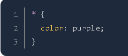
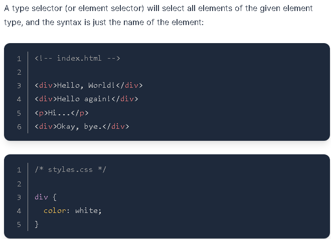
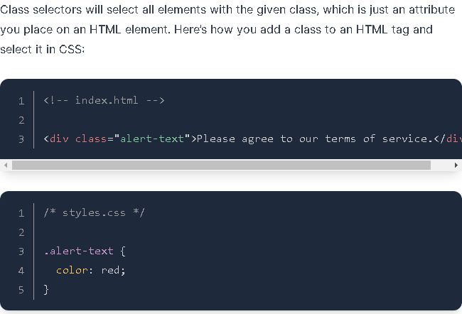
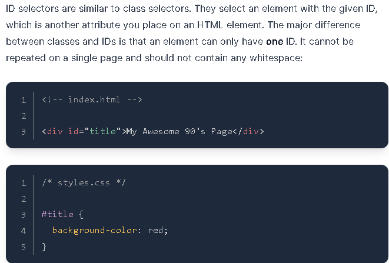

CSS Notes:
1. Universal Selector:

2. Type Selectors:

3. Class Selectors:

Another thing you can do with the class attribute is to add multiple classes to a single element as a space-separated list, such as class="alert-text severe-alert".

4. ID Selectors:

